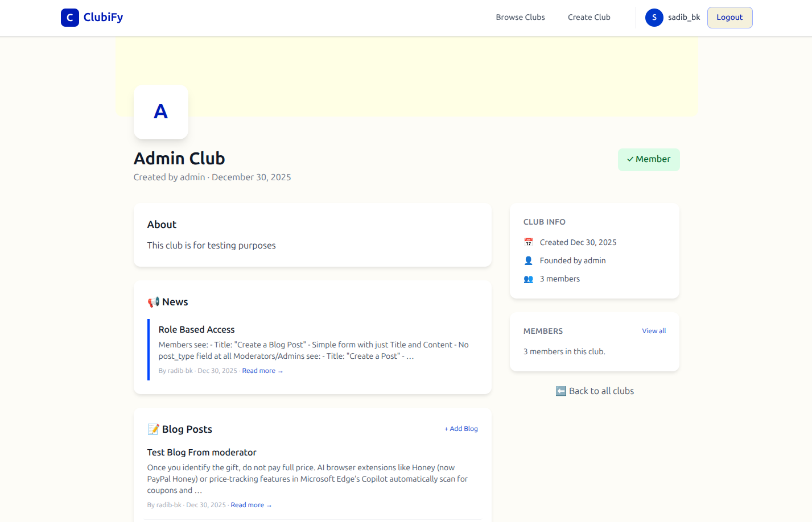
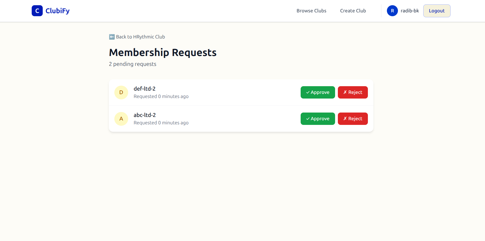

# ClubiFy

A Django-based club management platform where users can create clubs, manage memberships with role-based permissions, and share content through blogs and news posts.

## Features

- User authentication (signup, login, logout)
- Create and browse clubs
- Role-based membership system (Admin, Moderator, Member)
- Membership request and approval workflow
- Blog posts (all members) and News posts (moderators/admins only)
- User profile with club memberships and pending requests
- Responsive design with Tailwind CSS

## Tech Stack

- Django 4.1.2
- PostgreSQL
- Tailwind CSS (with live reloading in Docker)
- Gunicorn (production)
- WhiteNoise (static files)
- Docker (with live code & CSS reloading)

---

## Screenshots







---

## Setup Instructions

### Prerequisites

**For Local Development:**
- Python 3.10+
- PostgreSQL 13+
- Node.js (for Tailwind CSS)

**For Docker Setup:**
- Docker and Docker Compose
- (Node.js and Python are included in the container)

---

### Option 1: Local Development Setup

#### 1. Clone the repository

```bash
git clone https://github.com/your-username/clubify.git
cd clubify
```

#### 2. Create virtual environment

```bash
python -m venv venv
source venv/bin/activate  # Linux/Mac
# or
venv\Scripts\activate  # Windows
```

#### 3. Install dependencies

```bash
pip install -r requirements.txt
```

#### 4. Create environment file

Create a `.env` file in the project root:

```bash
SECRET_KEY=your-secret-key-here
DEBUG=True
DB_NAME=clubify_db
DB_USER=postgres
DB_PASSWORD=your-password
DB_HOST=localhost
DB_PORT=5432
```

#### 5. Create PostgreSQL database

```bash
psql -U postgres
CREATE DATABASE clubify_db;
\q
```

#### 6. Run migrations

```bash
python manage.py migrate
```

#### 7. Create superuser (admin account)

```bash
python manage.py createsuperuser
```

Follow the prompts to set username, email, and password.

#### 8. Run the development server

```bash
python manage.py runserver
```

Access the application at `http://localhost:8000`

Admin panel at `http://localhost:8000/admin`

---

### Option 2: Docker Setup (Recommended for Development)

The Docker setup includes **live reloading** for both code and Tailwind CSS changes - no need to rebuild containers!

#### 1. Clone the repository

```bash
git clone https://github.com/your-username/clubify.git
cd clubify
```

#### 2. Create environment file (optional)

Create a `.env` file to override defaults:

```bash
SECRET_KEY=your-secret-key-here
DEBUG=True
DB_NAME=clubify_db
DB_USER=postgres
DB_PASSWORD=9084
```

If no `.env` file is provided, Docker will use default values.

#### 3. Build and start containers

```bash
docker-compose up -d --build
```

This starts:
- PostgreSQL database on port 5433
- Django application on port 8001 (with auto-reload enabled)
- Tailwind CSS watch mode (auto-compiles CSS on changes)
- Migrations run automatically on container startup

#### 4. Create superuser (admin account)

```bash
docker-compose exec web python manage.py createsuperuser
```

#### 5. Access the application

- Application: `http://localhost:8001`
- Admin panel: `http://localhost:8001/admin`

#### Live Reloading Features

The Docker setup automatically reloads changes:

- **Python/Django code changes** → Django development server auto-reloads (no restart needed)
- **Tailwind CSS changes** (`static/src/input.css`) → Automatically compiled to `static/css/output.css` (no restart needed)
- **Template/HTML changes** → Django auto-reloads

Just save your files and see changes instantly in the browser!

#### Docker commands reference

```bash
# Start containers
docker-compose up -d

# Start with rebuild (first time or after Dockerfile changes)
docker-compose up -d --build

# View logs (see both Django and Tailwind processes)
docker-compose logs -f web

# Run migrations manually (if needed)
docker-compose exec web python manage.py migrate

# Run Django management commands
docker-compose exec web python manage.py <command>

# Stop containers
docker-compose down

# Stop and remove all volumes (including database)
docker-compose down -v
```

#### Production Deployment

For production, modify `docker-compose.yml` to use Gunicorn instead of the development server:

```yaml
web:
  # ... other config ...
  command: gunicorn --bind 0.0.0.0:8000 --workers 3 --threads 2 clubify.wsgi:application
```

---

## Project Structure

```
clubify/
├── accounts/          # User authentication
├── clubs/             # Club management
├── memberships/       # Membership and roles
├── posts/             # Blog and news posts
├── templates/         # Base templates
├── static/            # CSS (Tailwind)
├── clubify/           # Project settings
├── Dockerfile
├── docker-compose.yml
└── requirements.txt
```

---

## Role Permissions

| Action | Member | Moderator | Admin |
|--------|--------|-----------|-------|
| View club content | Yes | Yes | Yes |
| Create blog posts | Yes | Yes | Yes |
| Create news posts | No | Yes | Yes |
| View member list | Yes | Yes | Yes |
| Approve/reject requests | No | No | Yes |
| Promote/demote members | No | No | Yes |

---


## License

MIT License
