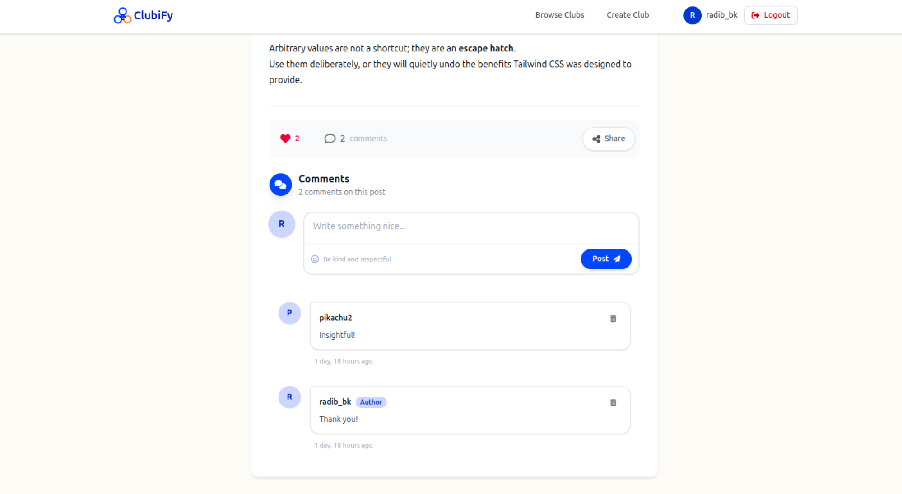

<table>
  <tr>
    <td>
      
    </td>
    <td>
      <h1>ClubiFy</h1>
    </td>
    <td align="right">
      <a href="https://radibbk.pythonanywhere.com/">
        
      </a>
    </td>
  </tr>
</table>

## A Django-powered club management platform for discovering clubs, managing role-based memberships, and publishing news/blog posts.


## Highlights
- Authentication (signup, login, logout)
- Create and browse clubs
- Role-based memberships (Admin, Moderator, Member)
- Membership requests with approve / reject workflow
- Publish blog posts (members) and news posts (mods / admins)
- Delete posts (mods/admins) and remove members (admins)
- **Like, Comment & Share** on posts
- AI post summarizer
- User profiles with memberships and pending requests
- Responsive UI with Tailwind CSS

---

## Tech Stack

| Backend | Frontend | Infra/Tooling |
| --- | --- | --- |
|    |  |     |

---

## Quick Links
- [🌐 Live Demo](https://radibbk.pythonanywhere.com/)
- [Screenshots](#screenshots-user-flow)
- [Setup (Local)](#option-1-local-development-setup)
- [Setup (Docker)](#option-2-docker-setup-recommended)
- [Project Structure](#project-structure)

---

## Screenshots

### Getting Started

| Register | Browse Clubs |
|:--------:|:------------:|
|  |  |
| Create your account to join clubs | Discover and explore available clubs |

### Club Management

| Create Club | Club Details | Member Management |
|:-----------:|:------------:|:-----------------:|
|  |  |  |
| Start your own community | View club info, news & blogs | Manage members and roles |

### Content & Interaction

| Create Post | Browse Posts |
|:-----------:|:------------:|
|  |  |
| Write blog posts or news updates | View all posts in a club |

| Post Details | Comments | Share |
|:------------:|:--------:|:-----:|
|  |  |  |
| Read full post content | Engage with the community | Share to social media |

### Features

| AI Summarizer | User Profile |
|:-------------:|:------------:|
|  |  |
| Get AI-powered post summaries | View your memberships & activity |


---

## Setup Instructions

### Prerequisites

**For Local Development:**
- Python 3.10+
- PostgreSQL 13+
- Node.js (for Tailwind CSS)

**For Docker Setup:**
- Docker and Docker Compose
- (Node.js and Python are included in the container)

---

### Option 1: Local Development Setup

#### 1. Clone the repository

```bash
git clone https://github.com/Radib-BK/ClubiFy.git
cd ClubiFy
```

#### 2. Create virtual environment

```bash
python -m venv venv
source venv/bin/activate  # Linux/Mac
# or
venv\Scripts\activate  # Windows
```

#### 3. Install dependencies

```bash
pip install -r requirements.txt
```

#### 4. Create environment file

Create a `.env` file in the project root:

```bash
SECRET_KEY=your-secret-key-here
DEBUG=True
DB_NAME=clubify_db
DB_USER=postgres
DB_PASSWORD=your-password
DB_HOST=localhost
DB_PORT=5432
```

#### 5. Create PostgreSQL database

```bash
psql -U postgres
CREATE DATABASE clubify_db;
\q
```

#### 6. Run migrations

```bash
python manage.py migrate
```

#### 7. Create superuser (admin account)

```bash
python manage.py createsuperuser
```

Follow the prompts to set username, email, and password.

#### 8. Run the development server

```bash
python manage.py runserver
```

Access the application at `http://localhost:8000`

Admin panel at `http://localhost:8000/admin`

---

### Option 2: Docker Setup (Recommended)

The entrypoint auto-runs migrations and Tailwind watch. Use these commands:

```bash
# Start (first time or after Dockerfile changes)
docker-compose up -d --build

# Follow logs (Django + Tailwind)
docker-compose logs -f web

# Create admin user
docker-compose exec web python manage.py createsuperuser
```

Access:
- App: http://localhost:8001
- Admin: http://localhost:8001/admin
- PostgreSQL: exposed on 5433 (container 5432)

Notes:
- Code changes auto-reload; Tailwind auto-compiles.
- To stop: `docker-compose down` (add `-v` to drop DB volume).
- **AI Summarizer**: The Hugging Face model (`sshleifer/distilbart-cnn-12-6`) is preloaded at startup for fast summarization. First startup may take 20-40 seconds to download and load the model.

### Configuration

You can customize the summarizer via environment variables:

```bash
# Optional: Override the default model (default: sshleifer/distilbart-cnn-12-6)
HF_SUMMARIZATION_MODEL=sshleifer/distilbart-cnn-12-6

# Optional: Skip preloading (models load on first request instead of at startup)
SKIP_SUMMARIZER_PRELOAD=false
```

---

## Project Structure

```
clubify/
├── accounts/          # User authentication
├── clubs/             # Club management
├── memberships/       # Membership and roles
├── posts/             # Blog and news posts
├── templates/         # Base templates
├── static/            # CSS (Tailwind)
├── clubify/           # Project settings
├── Dockerfile
├── docker-compose.yml
└── requirements.txt
```

---

## License

MIT License
